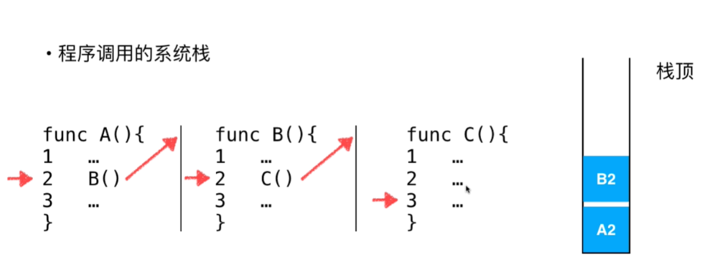
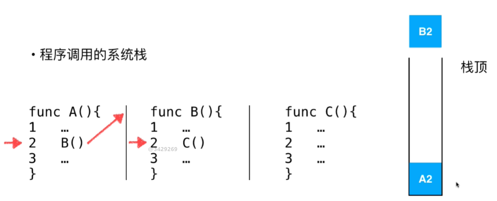

<!--
 * @Author: duanhaobin
 * @Date: 2021-03-23 16:13:02
-->
# 基础
## 栈
- 栈也是一种后进先出（LIFO）线性结构，
- 相比数组，栈对应的操作是数组的子集
- 只能从一端添加元素，也只能从同一端取出元素，这一端称为栈顶
## 操作

- `Stack.peek()` 返回栈顶元素,但不在堆栈中删除它。 
- `Stack.pop()` 返回栈顶元素,并在进程中删除它。

## 应用
### 无处不在的Undo(撤销)
### 程序调用的系统栈
假设有 函数A->函数B->函数C，调用中断（如A调B）时，程序底层会使用栈这种数据结构来保存函数调用栈信息和上下文

比如会保存上次调用的函数及调用位置，如`A2` 如图所示：

当函数C执行完后，会从栈中取出对应的值，也就是`B2`，那么便开始执行函数B，如图所示：

之后执行函数A，再取出栈中的值(`A2`)，然后开始执行

只有在函数中断的时候才会被压入栈，目的是为了保存它执行的一个状态，等待最后一个函数没有被中断执行完之后，在根据这个状态找到函数上次中断的位置再继续执行。
### 括号匹配——编译器

## 为什么使用栈来解决某一类问题？
一个非常容易忽略，但又很重要的事情就是：计算机中的这些结构都是用来解决实际问题，而这些实际问题的本质在我们日常生活有时常体现。

比如剥洋葱，其结构特殊，在一层一层剥时，左半部分右半部分是对称；想吃到最里面的内容，就必须一层一层往里剥，类似出栈
## 什么样的问题可以使用栈来解决

- 最近相关性问题，类似洋葱结构

