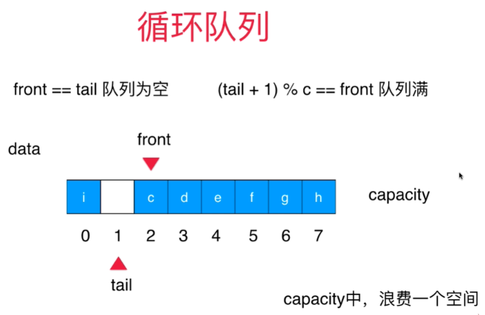

<!--
 * @Author: duanhaobin
 * @Date: 2021-03-24 18:04:46
-->

## Queue 队列 
- 栈也是一种先进先出（FIFO）线性结构，
- 相比数组，栈对应的操作是数组的子集
- 只能从一端（队尾）添加元素，只能从另一端（队首）取出元素

## 操作
### 普通队列
使用切片实现队列
#### 入队 Enqueue
- append()方法在尾部追加元素，即入队操作
- 时间复杂度：O(1)

#### 出队 Dequeue
- 时间复杂度：O(n)
在数组头部或中间进行更新操作，比如删除元素、插入元素、修改元素，都是O(n)复杂度，因为涉及到了底层数据的拷贝迁移

#### 获取队首 GetFront
- 时间复杂度：O(1)
获取索引`index=0`位置的值

####  获取队列大小 GetSize
- 时间复杂度：O(1)

因为切片底层的结构体种已经包含了 size 字段，所以直接返回该值

### 循环队列
循环队列，就是类似钟表，可以使用一个队列循环存元素、取元素，原理是通过移动“双索引”——队首front和队尾tail来调整数据所在位置。

值得注意的是：
- 队首： front ，注意**不是指索引为0的位置**，只要位于所有数组的首部，就是队首。每次出队，只要`front++`，即保证了一直时队首
- 队尾：tail，始终指向下一个元素入队的位置
- `front == tail` 表示队列为**空**
  - 其实当队列满的时候，front 也会等于tail，为了避免这种情况，循环队列特意“浪费”了一个空位置，不存任何元素，这样`front == tail` 就不会有二义性了
- `(tail + 1) % length == front` 表示队列**已满**，
  
如何做到循环的呢？

通常都会想到取余的操作，我们对**队列长度**取余就能保证所以是循环的，也就是说：

`(tail + 1) % length`的值来表示下一个元素入队的位置

具体如图：

