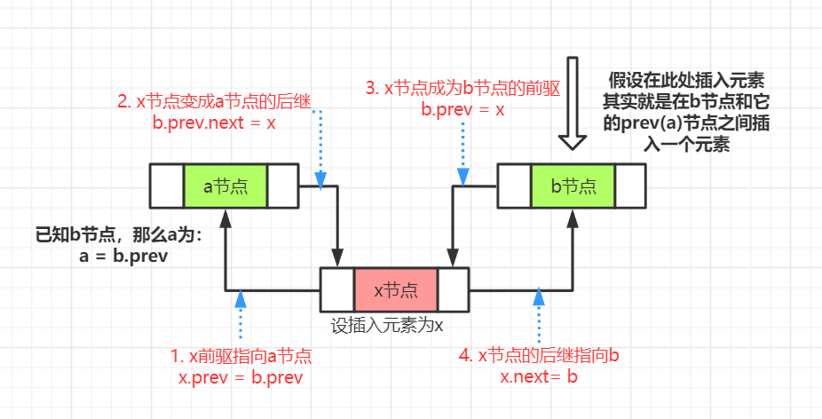

# 双向链表

## 一.双向链表简介
1、单链表的缺陷

单链表只能从头结点开始访问链表中的数据元素，如果需要逆序访问单链表中的数据元素将极其低效。

2、双向链表的结构

双链表是链表的一种，由节点组成，每个数据结点中都有两个指针，分别指向直接后继和直接前驱。


3、双向链表类的基本结构

```go
type Node struct{
    Val interface{}
    Next *Node
    Prev *Node
}

type DuLinkedList struct{
    Size int
    Head *DuLinkedList
    Tail *DuLinkedList
}
```

4、双向链表的对称性

节点前驱的后继 = 节点本身 = 节点后继的前驱

即：`p.prev.next = p = p.next.prev`
## 二.双向链表的增删操作

### 删除操作

删除操作比较简单，删除一个节点，将其的前驱指针和后继指针都更换点即可，具体为：

- 被删节点(node)之前的节点的后继next指针指向被删节点的下一个节点，即 `node.prev.next = node.next`
- 被删节点(node)下一个节点的前驱prev指针指向被删节点的前一个节点，即 `node.next.prev = node.prev`

### 增加操作
增加操作比较简单，增加一个节点，就是在某一个位置插入一个节点，需要移动4个指针，这样才能保证插入成功，如图：




已知b节点(入参或其他方式得到)，在b节点的位置插入元素，思路为:
- 找到b节点之前的元素，如a节点，即 `b.prev`
- 在a和b之间插入元素，也就是说将二者的prev和next指针双双指向要插入的元素
  
指针更改的思路如上图，具体代码：
```go
x.prev = b.prev
b.prev.next = x

x.next = b
b.prev = x
```
