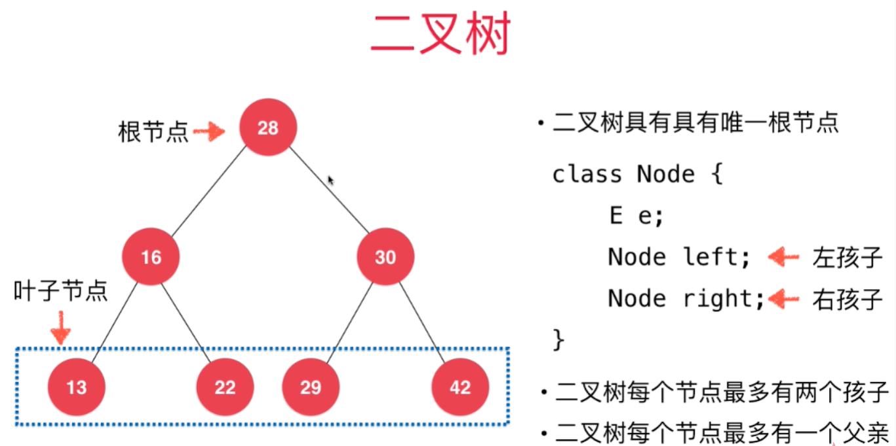
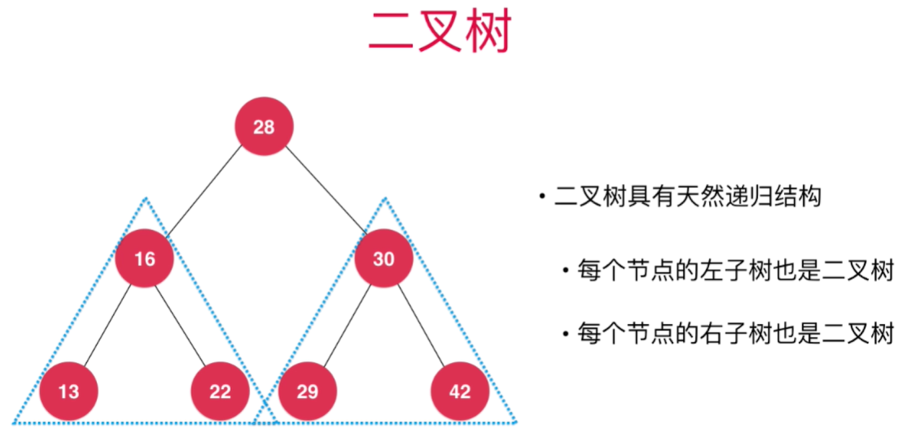
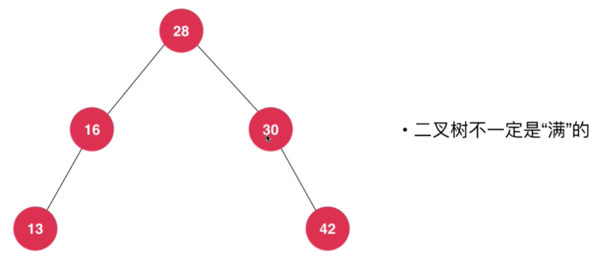
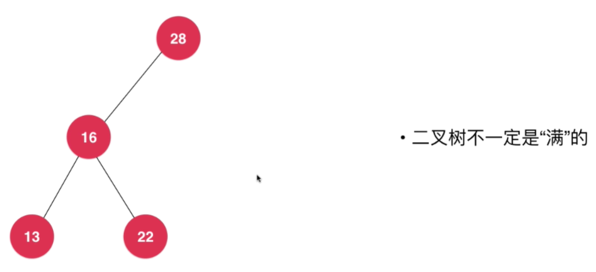
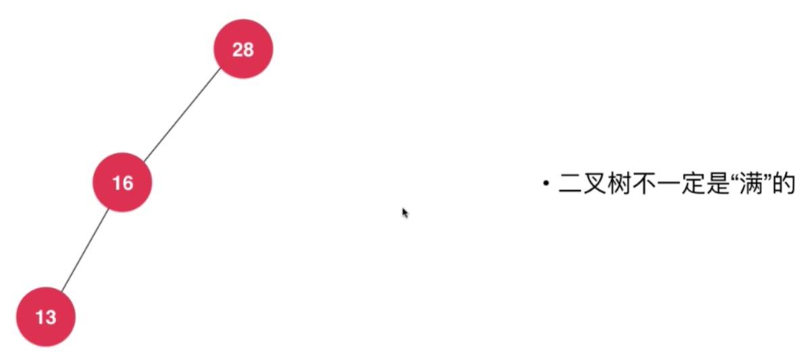
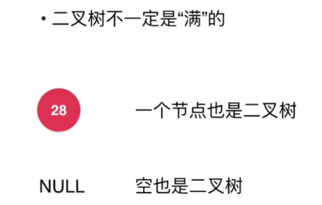

<!--
 * @Author: duanhaobin
 * @Date: 2021-03-25 14:31:49
-->
# 二叉树基础

- 根节点：最顶层的节点，其没有父亲节点
- 叶子节点：某节点不再衍生出其他节点，也就是说没有左右孩子，那么该节点就是叶子节点

## 天然递归结构

每个左右孩子都可以看成是一个独立的二叉树。

## 满二叉树

除了叶子节点外，其余每个节点都有两个孩子，那么这个二叉树就可以称为满二叉树。

上述两图展示的二叉树便是满二叉树。

但是要注意，并不是所有的二叉树都是满的，缺某个节点是正常情况

非满二叉树的示例：

**更极限的：单个节点，甚至是空节点也可以看作是一个二叉树**，因为只要其数据结构存在左右两个node，便可以组成二叉树结构，只不过这两个node都为null

