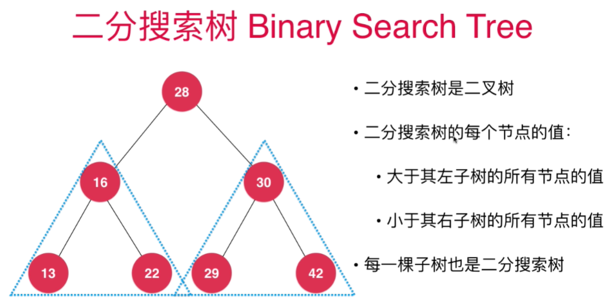

<!--
 * @Author: duanhaobin
 * @Date: 2021-03-25 14:45:03
-->
# 二分搜索树

二分搜索树(Binary Search Tree)，又称BST。



- 要注意核心：**是每一个节点**
- 二分搜索树也存在不满的情况，毕竟其本质还是一颗二叉树

二分搜索树查询很快，因为左子树的节点始终小于根节点，那么如果找比根节点还小的数据，直接去左子树找，就省下了去右子树查找的时间。

## 添加元素

向二分搜索树中添加元素时，一般不包含重复元素，如果想包含重复元素，只需要改变定义：
- 左子树小于**等于**节点；右子树大于**等于**节点
  
注意：链表和数组是可以包含重复元素的
## 二叉树遍历

有如下二叉树示例：
```
               5
              / \     
             3   6
            / \   \
           2   4   8
```

### 前序遍历
前序遍历：先访问节点，然后遍历这个节点的左右子树

也称为深度优先遍历

- 最自然的遍历方式，也是最常用的遍历方式
  
遍历的结果：5,3,2,4,6,8
- 第一个元素为根节点
- 之后比根节点**小**的是**左**子树所有的值
- 之后比根节点**大**的是**右**子树所有的值
## 中序遍历
中序遍历：先遍历节点左子树，然后访问节点，最后遍历节点的右子树

遍历的结果：2,3,4,5,6,8，是按顺序排列的，因为左(小) < 根 < 右(大)
- 第一个元素为左子树最小的节点
- **左**子树所有节点的值**小于**根节点 
- **右**子树所有节点的值**大于**根节点 
## 后序遍历
后序遍历：先遍历节点左右子树，最后访问节点

也就说先处理某节点的孩子节点后，再来处理这个节点

遍历的结果：2,4,3,8,6,5
- 最后一个元素为根节点
- **左**子树所有节点的值**小于**根节点 
- **右**子树所有节点的值**大于**根节点 

应用：手动释放内存

## 层序遍历
层序遍历：顾名思义，就是一层遍历再遍历一层，这种方式又叫广度优先遍历，

- 通过队列实现

相比较深度优先遍历，广度优先遍历的意义：

- 可以更快的找到目标元素，擅长搜索；因为深度优先遍历会选其中一个节点(通常为左节点)一股脑儿的算到树最深处，而广度优先遍历是一层一层的搜索，有可能我们的目标元素就在另一颗子树的前几层节点上
- 常用于求解无权图的最短路径