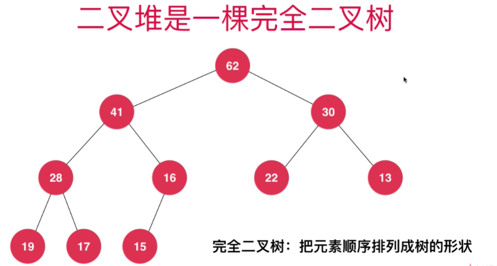
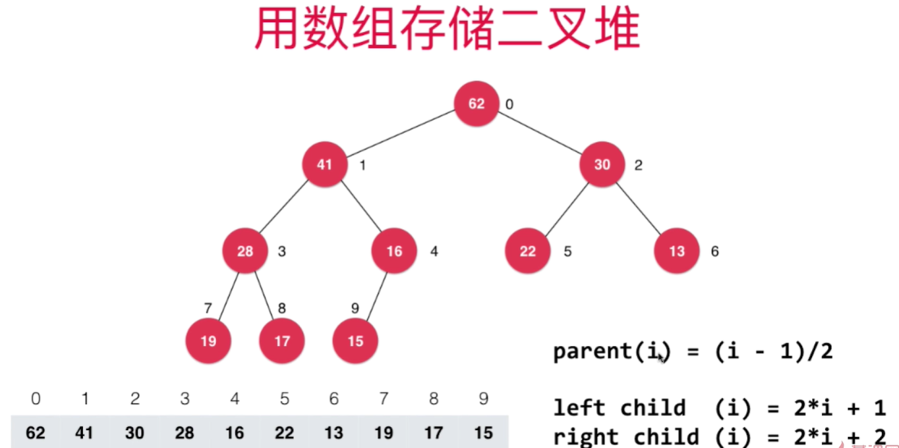

<!--
 * @Author: duanhaobin
 * @Date: 2021-03-26 16:02:15
-->
# 堆

一般地，如果一个数据结构的时间复杂度为O(logn)，那么该数据结构很可能与树有关

堆本质上也是一棵树结构。

使用二叉树实现的堆又称二叉堆，二叉堆有以下特性：
- 是一棵完全二叉树
  - 完全二叉树：元素一层一层的存放，从左到右依次向节点中存入元素，直到元素都放完
  

- 堆中任意节点的值总是小于其父节点的值，也就是说，根节点的值是最大的。故又称最大堆
  - 层次（深度）高的节点值不一定比层次（深度）低的节点值大，如上图中第3层的19大于第2层的16

使用数组实现二叉堆，i表示当前索引，可以根据当前index所表示的元素来计算出其父节点和其左右子节点所在的index：
- 父节点的索引：`parent(i) = (i - 1)/2`
- 左节点的索引：`left child (i) = 2*i + 1`
- 右节点的索引：`right child (i) = 2*i + 2`
